# CRM для турагенства, специализирующегося на создании и реализации авторских туров 
Две ключевые роли в таком турагенстве - туроператор (разрабатывает туры, продумывает маршруты, экскурсии, логистику. Согласовывает условия с партнерами: отелями, транспортными компаниями)
и менеджер (работает с клиентами: консультирует, поддерживает связь на всех этапах, контролирует оплату и документооборот)

## Работа менеджера
#### Взаимодействие с клиентом
- Система должна регистрировать клиента с обязательными полями:  
  - ФИО  
  - Номер телефона  
  - Email
  - Дата рождения  
  - Город вылета  
- Система должна предоставлять возможность внесения паспортных данных клиента при заключении договора.  

- Система должна фиксировать все контакты с клиентом, включая:  
  - Дата и время в формате UTC  
  - Средство связи:  
    - Телефонный звонок 
    - Telegram  
    - WhatsApp  
    - Электронная почта  
    - Личная встреча (с указанием места)  
  - Тип взаимодействия:  
    - Обсуждение (выявление потребностей, уточнение деталей)  
    - Согласование условий  
    - Рекламация (претензия к услугам)  
  - Итоги:  
    - Краткое описание (1-2 предложения)  
    - Зафиксированные договорённости  
  - Напоминание о следующем шаге:  
    - Дата и время (с учётом часового пояса клиента)  
    - Предпочтительный способ связи  
    - Тема

- Система должна предоставлять возможность добавления клиента в черный список
- Система должна предоставлять возможность для автоматической рассылки уведомлений клиентам:  
    - за 6 месяцев до истечения срока паспорта
    - за сутки до вылета
    - напоминания об оплате за 3 суток до истечения срока оплаты
  
- Система должна предоставлять возможность для автоматической рекламной рассылки: 
    - анонсы новых авторских туров, предлагаемых агенством
    - горящие туры ([подробнее](#создание-тура))
    - начало раннего бронирования 
    - поздравление и персональное предложение в 12:00 по локальному времени клиента в день его рождения

#### Управление бронированием
- Система должна позволять привязывать к одному бронированию список клиентов, зарегистрированных в системе

- Система должна поддерживать следующие статусы договора бронирования: 
    - черновик
    - ожидает подписания договора
    - ожидает оплаты
    - частичная оплата
    - полная оплата
    - запрос отмены бронирования
    - аннулирование 

- Система должна автоматически:  
  - Генерировать договор, подставляя в шаблон:  
    - Данные клиента (ФИО, паспорт)  
    - Параметры тура (даты, стоимость, услуги)  
  - Отправлять договор клиенту через Контур.Крипто для подписания.  

- Система должна автоматически:  
  - Создавать согласие на обработку персональных данных по шаблону.  
  - Отправлять согласие клиенту вместе с договором через Контур.Крипто.
  
- Система должна:  
  - Интегрироваться с платежной системой ЮKassa.  
  - Формировать ссылку/QR-код для оплаты бронирования.  
  - Обновлять статус договора при успешной оплате.  

## Работа туроператора
#### Создание тура 
- Система должна регистрировать тур с обязательными параметрами:
    - Уникальное название тура
    - Даты: согласованные с отелями и перевозчиками интервалы дат на 6–12 месяцев вперед
    - **Маршрут** - последовательность точек тура в порядке посещения
      - Последовательностью точек (с возможностью изменения порядка)  
      - Для каждой точки:
        - Название
        - Адрес  
        - Длительность пребывания в формате (дни-часы-минуты)
    - Стоимость - конечная стоимость для туриста (EUR)
    - Включенные услуги 
        - **Трансфер**:  
          - Точки отправления/прибытия (с привязкой к карте)  
          - Время в пути (дни-часы-минуты)  
          - Время отправления (с учётом часового пояса клиента)  
          - Транспортная компания (выбор из базы партнёров)  
          - Модель транспортного средства  

        - **Экскурсии**
            - Название
            - Контакты организатора - имя, телефон, email

        - **Тип питания** 
          - Завтраки
          - Полупансион
          - Полный пансион
          
        - **Включенная страховка**
            - Тип покрытия
              - Медицинская
              - Потеря багажа 
              
            - Страховая компания - название, телефон, email

- Система должна привязывать зарегистрированные в системе отели к турам

### 
- Система должна автоматически помечать тур как "горящий" при:  
  - Продаже >60% мест от общей квоты (не требует подтверждения статуса)
  - Остатке ≤30 дней до начала тура (требует ручного подтверждения статуса менеджером)

#### Взаимодействие с отелем
- Система должна хранить записи отелей-партнеров, включая:  
   - Адрес
   - Перечень категорий номеров (например: стандартный, люкс, семейный)
   - Диапазон цен за категорию номера (EUR).  
   - Условия отмены бронирования
     - Сроки
     - Штрафы
     - Исключения

- Система должна фиксировать все контакты с администрацией отеля, включая:  
  - Дата и время в формате UTC  
  - Средство связи:  
    - Телефонный звонок 
    - Telegram  
    - WhatsApp  
    - Электронная почта  
    - Личная встреча (с указанием места)  
  - Тип взаимодействия:  
    - Обсуждение 
    - Согласование условий  
    - Рекламация 
  - Итоги:  
    - Краткое описание (1-2 предложения)  
    - Зафиксированные договорённости  
  - Напоминание о следующем шаге:  
    - Дата и время (с учётом часового пояса, в котором расположен отель)  
    - Предпочтительный способ связи  
    - Тема

# ERD

```plantuml
@startuml
skinparam Linetype ortho


' ----- CLIENT -----

entity client {
  + client_id: INTEGER <<PK>> 
  --
  full_name: VARCHAR(255) NOT NULL
  phone: VARCHAR(20) NOT NULL
  email: VARCHAR(255) NOT NULL
  birth_date: DATE NOT NULL
  departure_city: VARCHAR(100) NOT NULL
  is_blacklisted: BOOLEAN DEFAULT FALSE
  timezone: VARCHAR(50) NOT NULL
}

entity passport {
  + passport_id: INTEGER <<PK>>
  --
  client_id: INTEGER <<FK>> (client)
  number: VARCHAR(50) NOT NULL
  expiration_date: DATE NOT NULL
  issue_date: DATE NOT NULL
}

entity foreign_passport {
  + passport_id: INTEGER <<PK>>
  --
  client_id: INTEGER <<FK>> (client)
  number: VARCHAR(50) NOT NULL
  expiration_date: DATE NOT NULL
  issue_date: DATE NOT NULL
}

entity client_interaction {
  + interaction_id: INTEGER <<PK>>
  --
  client_id: INTEGER <<FK>> (client)
  interaction_date_utc: TIMESTAMP NOT NULL
  communication_channel: communication_channel NOT NULL
  meeting_location: VARCHAR(255)
  interaction_type: interaction_type NOT NULL
  summary: TEXT
  agreements: TEXT
  next_contact_reminder_id: INTEGER <<FK>> (client_next_contact_reminder)
}

entity client_next_contact_reminder {
  + reminder_id: INTEGER <<PK>>
  --
  client_id: INTEGER <<FK>> (client)
  communication_channel: communication_channel NOT NULL
  message: TEXT NOT NULL
  send_date: TIMESTAMP NOT NULL
}

entity client_personal_notification {
  + notification_id: INTEGER <<PK>>
  --
  client_id: INTEGER <<FK>> (client)
  communication_channel: communication_channel NOT NULL
  template_id: INTEGER <<FK>> (notification_template)
  send_date: TIMESTAMP NOT NULL
}

entity notification_template {
  + template_id: INTEGER <<PK>>
  --
  type: notification_type NOT NULL
  message_template: TEXT NOT NULL
}



' ----- BOOKING & CONTRACTS -----

entity booking {
  + booking_id: INT <<PK>>
  --
  tour_id: INT <<FK>> 
  status: booking_status DEFAULT 'draft'
  contract_number: VARCHAR(50) UNIQUE
  payment_link: TEXT
  created_at: DATETIME DEFAULT CURRENT_TIMESTAMP
  updated_at: DATETIME ON UPDATE CURRENT_TIMESTAMP
}

entity client_booking {
  + client_id: INT <<PK,FK>> 
  + booking_id: INT <<PK,FK>> 
}

entity booking_agreement {
  + agreement_id: INT <<PK>>
  --
  client_id: INT <<FK>> 
  booking_id: INT <<FK>> 
  signed_date: TIMESTAMP NOT NULL
}

entity assignee {
  + assignee_id: INT <<PK>>
  --
  client_id: INT <<FK>> 
}

entity contract_template {
  + template_id: INT <<PK>>
  --
  name: VARCHAR(100) NOT NULL
  type: VARCHAR(50) NOT NULL
  template_content: TEXT NOT NULL
  validity_period_days: INT NOT NULL
}

entity contract {
  + contract_id: INT <<PK>>
  --
  assignee_id: INT <<FK>> 
  contract_template_id: INT <<FK>>
  issue_date: TIMESTAMP NOT NULL
  sign_date: TIMESTAMP
  status: consent_status NOT NULL
  total_price: DECIMAL(10,2) NOT NULL
}

entity agreement_consent {
  + consent_id: INT <<PK>>
  --
  assignee_id: INT <<FK>> 
  contract_id: INT <<FK>> 
  consent_type: consent_types NOT NULL
  consent_date: TIMESTAMP NOT NULL
  status: consent_status NOT NULL
}

entity consent_template {
  + consent_template_id: INT <<PK>>
  --
  name: VARCHAR(100) NOT NULL
  type: consent_types NOT NULL 
  template_content: TEXT NOT NULL
}

entity payment_link {
  + payment_link_id: INT <<PK>>
  --
  booking_id: INT <<FK>> 
  payment_url: VARCHAR(255) NOT NULL
  qr_code: VARCHAR(255) NOT NULL
  status: VARCHAR(50) NOT NULL
}



' ----- TOUR -----

entity tour {
  + tour_id: INT <<PK>>
  --
  title: VARCHAR(255) NOT NULL UNIQUE
  price_eur: DECIMAL(10,2) NOT NULL
  quota: INT NOT NULL
  meals_type : meals_type
  is_lastminute: BOOLEAN DEFAULT FALSE
  lastminute_approved: BOOLEAN
  base_duration_days: INT NOT NULL
}

' Usually tour runs several iterations during the year
entity tour_iteration { 
  + schedule_id: INT <<PK>>
  --
  tour_id: INT <<FK>> 
  start_date: DATE NOT NULL
  end_date: DATE NOT NULL
  --
  UNIQUE(tour_id, start_date)
}

entity tour_route {
  + route_id: INT <<PK>>
  --
  tour_id: INT <<FK>> 
  order_position: INT NOT NULL
}

entity route_point {
  + point_id: INT <<PK>>
  --
  route_id: INT <<FK>> 
  name: VARCHAR(255) NOT NULL
  address: TEXT NOT NULL
}

entity transfer {
  + transfer_id: INT <<PK>>
  --
  tour_id: INT <<FK>> 
  departure_point: point_id NOT NULL <<FK>>
  arrival_point: point_id NOT NULL <<FK>>
  transport_company: VARCHAR(255) NOT NULL
  vehicle_model: VARCHAR(255)
  departure_time: DATETIME NOT NULL
  duration_time : INTERVAL NOT NULL
}

entity excursion {
  + excursion_id: INT <<PK>>
  --
  tour_id: INT <<FK>> 
  name: VARCHAR(255) NOT NULL
  meeting_location : point_id NOT NULL
  organizer_name: VARCHAR(255) NOT NULL
  organizer_phone: VARCHAR(20) NOT NULL
  organizer_email: VARCHAR(255) NOT NULL
  duration_time : INTERVAL
}

entity insurance {
  + insurance_id: INT <<PK>>
  --
  tour_id: INT <<FK>> 
  coverage_type: ENUM('medical','lost_luggage') NOT NULL
  company_name: VARCHAR(255) NOT NULL
  company_phone: VARCHAR(20) NOT NULL
  company_email: VARCHAR(255) NOT NULL
}

entity hotel {
  + hotel_id: INT <<PK>>
  --
  name: VARCHAR(255) NOT NULL
  address: TEXT NOT NULL
  room_categories: JSON NOT NULL
  price_range: VARCHAR(100) NOT NULL
  cancellation_terms: TEXT NOT NULL
}

entity hotel_interaction {
  + interaction_id: INT <<PK>>
  --
  hotel_id: INT <<FK>> 
  interaction_date_utc: DATETIME NOT NULL
  communication_channel: communication_channel NOT NULL
  interaction_type: interaction_type NOT NULL
  summary: TEXT
  agreements: TEXT
  next_contact_reminder : reminder_id <<FK>>
}

entity hotel_next_contact_reminder {
  + reminder_id: INT <<PK>>
  --
  hotel_id: INT <<FK>> 
  communication_channel: communication_channel NOT NULL
  message: TEXT NOT NULL
  send_date: TIMESTAMP NOT NULL
}

entity promotion {
  + promo_id: INT <<PK>>
  --
  title: VARCHAR(255) NOT NULL
  content: TEXT NOT NULL
  promo_type: promotion_type NOT NULL
  created_at: DATETIME DEFAULT CURRENT_TIMESTAMP
}



' ENUM Definitions

note top of client_interaction
  **communication_channel**:
  - phone
  - telegram
  - whatsapp
  - email
  - meeting
  
  **interaction_type**:
  - discussion
  - agreement
  - complaint
end note

note top of promotion
  **promotion_type**
  - new_tours
  - hot_tours
  - early_booking
  - birthday_promo
end note

note top of booking
  **booking_status**:
  - draft
  - pending_signature
  - pending_payment
  - partially_paid
  - fully_paid
  - cancellation_requested
  - canceled
end note

note top of agreement_consent
  **consent_types**:
  - personal_data
  - contract_terms
  - ad
  
  **consent_status**:
  - granted
  - pending
  - revoked
end note

note top of hotel_interaction
  **interaction_type**:
  - discussion
  - agreement
  - claim
end note

note top of tour
  **meals_type**
  - breakfast
  - half_board
  - full_board
end note

note top of notification_template
  **notification_type**:
  - passport_expiry
  - flight_reminder
  - payment_reminder
end note



' Relationships

client ||--o{ passport
client ||--o{ foreign_passport
client ||--o{ client_interaction
client ||--o{ client_booking
client_booking }o--|| booking
client_interaction ||--|| client_next_contact_reminder
client_personal_notification }o--|| notification_template
client ||--o{ client_personal_notification

booking ||--|| tour
tour ||--o{ tour_route
tour ||--o{ tour_iteration
tour_route ||--o{ route_point
tour ||--o{ transfer
tour ||--o{ excursion
tour ||--o{ insurance
tour }o--o{ hotel
excursion ||--|| route_point

hotel ||--o{ hotel_interaction
hotel_interaction ||--|| hotel_next_contact_reminder

booking ||--o{ booking_agreement
assignee ||--o{ contract
assignee ||--|| client 
contract_template ||--o{ contract
contract ||--o{ agreement_consent
consent_template ||--o{ agreement_consent
booking ||--o{ payment_link

@enduml
```
